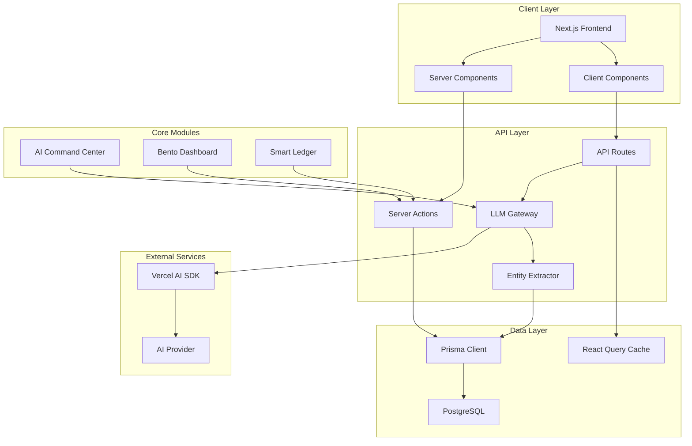
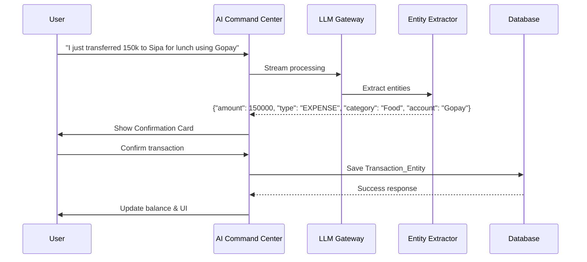

# Design Document

## Overview

NOMOS (Order/Law) is an autonomous financial intelligence system that transforms unstructured financial data into structured insights through AI-first automation. The system comprises three core modules: **AI Command Center** (conversational AI interface), **Bento Dashboard** (analytical overview), and **Smart Ledger** (data management), unified by a streaming-first architecture built on Next.js 15+ with React Server Components.

The design implements an **AI-First Ingestion Pipeline** where natural language serves as the primary data entry method, powered by the Vercel AI SDK for streaming responses and entity extraction. The system processes unstructured input (casual text, voice transcripts, receipts) through an LLM Gateway and converts it into validated database records using Prisma 7 with PostgreSQL.

### Key Design Principles

1. **AI-First Architecture**: Natural language input as primary interface, not traditional forms
2. **Streaming Performance**: Real-time UI updates using RSC streaming and progressive hydration  
3. **Autonomous Intelligence**: System learns patterns and provides proactive insights
4. **Midnight Tech Aesthetic**: Dark-first design with functional neon accents for financial focus
5. **Modular Composition**: Each module operates independently while sharing core infrastructure

## Architecture

### System Architecture Overview



### AI-First Ingestion Pipeline

The core innovation is positioning AI as the primary data entry gateway rather than traditional form-based input:

**Flow:** Natural Language Input → LLM Gateway → Entity Extractor → Confirmation Card → Database Commit



### Three-Module Component Architecture

#### 1. AI Command Center (`/command-center`)
- **Stream Chat**: Left column with streaming conversation interface
- **Predictive Canvas**: Right column with future impact visualizations  
- **Confirmation Cards**: Interactive transaction approval workflow
- **LLM Gateway Integration**: Streaming text with progressive token rendering

#### 2. Bento Dashboard (`/dashboard`)
- **Vault Widget** (2x2): Total net worth with mini-sparkline
- **Quick Command Bar** (2x1): Terminal-style AI input for quick commands
- **Budget Radar** (1x2): Circular progress with spending limits
- **Cashflow Matrix** (2x2): Side-by-side income/expense bar charts

#### 3. Smart Ledger (`/ledger`)
- **Virtualized Transaction Table**: @tanstack/react-table with 10k+ row performance
- **Global Search Filter**: Real-time filtering across description/category/account
- **Inline Editing**: Direct cell editing for category/amount fields
- **CSV Export**: Filtered transaction export with sanitization

### Database Design

The existing Prisma schema provides a solid foundation with necessary entities. Key optimizations for the design:

#### Schema Analysis
Current schema supports all requirements:
- **User**: Multi-tenant isolation with CASCADE deletes
- **Account**: Balance synchronization with transaction updates  
- **Transaction**: Immutable audit trail with `rawPrompt` field
- **Budget**: Period-based spending limits with auto-rollover support
- **AiInsight**: Automated anomaly detection and suggestions

#### Performance Optimizations
1. **Connection Pooling**: Use `@prisma/adapter-pg` for edge-compatible connections
2. **Atomic Updates**: Balance synchronization within database transactions
3. **Indexed Queries**: Add indexes on `userId + timestamp` for transaction queries
4. **Cascading Deletes**: Maintain referential integrity with ON DELETE CASCADE

#### Suggested Schema Additions
```sql
-- Add performance indexes
CREATE INDEX idx_transactions_user_timestamp ON "Transaction"("userId", "timestamp" DESC);
CREATE INDEX idx_budgets_user_category ON "Budget"("userId", "category");
CREATE INDEX idx_aiinsights_user_unread ON "AiInsight"("userId", "isRead", "createdAt" DESC);

-- Add data validation constraints
ALTER TABLE "Transaction" ADD CONSTRAINT check_amount_positive CHECK ("amount" > 0);
ALTER TABLE "Account" ADD CONSTRAINT check_balance_realistic CHECK ("balance" > -1000000);
```

## Components and Interfaces

### LLM Gateway Design

**Architecture**: Edge Function + Serverless Function Split
- **Edge Function**: Handles streaming orchestration with low latency
- **Serverless Function**: Processes LLM inference and entity extraction
- **Timeout Handling**: Background job queue for requests exceeding 30s limit

```typescript
// /api/ai/chat/route.ts - Edge Function for streaming
export const runtime = 'edge'

export async function POST(request: Request) {
  const { messages } = await request.json()
  
  const result = await streamText({
    model: openai('gpt-4-turbo'),
    messages,
    onChunk: ({ chunk }) => {
      // Progressive streaming to client
    },
    tools: {
      extractTransaction: {
        description: 'Extract transaction from natural language',
        parameters: extractionSchema,
        execute: async ({ input }) => {
          // Call Entity Extractor
          return await extractEntities(input)
        }
      }
    }
  })
  
  return result.toDataStreamResponse()
}
```

### Entity Extractor Implementation

**Purpose**: Convert natural language to structured Transaction entities
**Technology**: Function calling with Zod schema validation
**Performance Target**: <2.5s extraction latency

```typescript
const transactionSchema = z.object({
  amount: z.number().positive(),
  type: z.enum(['INCOME', 'EXPENSE']),
  category: z.string().min(1),
  account: z.string().min(1),
  description: z.string().min(1),
  confidence: z.number().min(0).max(1)
})

export async function extractEntities(rawInput: string, userId: string) {
  const result = await generateObject({
    model: openai('gpt-4-turbo'),
    schema: transactionSchema,
    prompt: `Extract transaction details from: "${rawInput}"
    
    User's recent accounts: ${await getUserAccounts(userId)}
    User's common categories: ${await getUserCategories(userId)}
    
    Use context clues to match account names and prefer user's historical patterns.`
  })
  
  if (result.object.confidence < 0.7) {
    throw new Error('CLARIFICATION_NEEDED')
  }
  
  return result.object
}
```

### Confirmation Card Component

Interactive UI component for transaction verification before database commit:

```typescript
interface ConfirmationCardProps {
  extractedData: TransactionExtraction
  onConfirm: (data: TransactionExtraction) => void
  onCancel: () => void
  rawInput: string
}

export function ConfirmationCard({ extractedData, onConfirm, onCancel, rawInput }: ConfirmationCardProps) {
  return (
    <div className="border border-border rounded-lg p-4 bg-card">
      <div className="text-sm text-muted mb-2">Transaction extracted from:</div>
      <div className="text-xs font-mono bg-zinc-900 p-2 rounded mb-4">{rawInput}</div>
      
      <div className="space-y-2">
        <div className="flex justify-between">
          <span className="text-muted">Amount:</span>
          <span className="font-financial font-semibold">{formatCurrency(extractedData.amount)}</span>
        </div>
        <div className="flex justify-between">
          <span className="text-muted">Type:</span>
          <span className={extractedData.type === 'INCOME' ? 'text-positive' : 'text-negative'}>
            {extractedData.type}
          </span>
        </div>
        <div className="flex justify-between">
          <span className="text-muted">Category:</span>
          <span>{extractedData.category}</span>
        </div>
        <div className="flex justify-between">
          <span className="text-muted">Account:</span>
          <span>{extractedData.account}</span>
        </div>
      </div>
      
      <div className="flex gap-2 mt-4">
        <Button onClick={() => onConfirm(extractedData)} className="flex-1">
          Confirm & Save
        </Button>
        <Button variant="outline" onClick={onCancel}>
          Cancel
        </Button>
      </div>
    </div>
  )
}
```

### Predictive Canvas Visualization

**Purpose**: Show financial impact projections for hypothetical spending
**Technology**: Recharts with custom forecasting algorithm
**Formula**: `B(t) = B₀ + Σᵢ₌₁ⁿ Iᵢ(t) - Σⱼ₌₁ᵐ Eⱼ(t) - (ω · Mₐᵥₓ · t)`

```typescript
interface ForecastData {
  day: number
  baselineBalance: number
  withHypotheticalBalance: number
}

export function PredictiveCanvas({ hypotheticalExpense }: { hypotheticalExpense?: number }) {
  const { data: forecastData } = useQuery({
    queryKey: ['forecast', hypotheticalExpense],
    queryFn: () => generateForecast({ hypotheticalExpense, days: 90 })
  })
  
  return (
    <div className="h-full p-4">
      <h3 className="text-lg font-semibold mb-4">Financial Impact Projection</h3>
      <ResponsiveContainer width="100%" height="80%">
        <LineChart data={forecastData}>
          <XAxis dataKey="day" />
          <YAxis tickFormatter={formatCurrency} />
          <CartesianGrid strokeDasharray="3 3" />
          
          <Line 
            type="monotone" 
            dataKey="baselineBalance" 
            stroke="#06b6d4" 
            strokeWidth={2}
            name="Current trajectory"
          />
          
          {hypotheticalExpense && (
            <Line 
              type="monotone" 
              dataKey="withHypotheticalBalance" 
              stroke="#f43f5e" 
              strokeWidth={2} 
              strokeDasharray="5 5"
              name="With purchase"
            />
          )}
          
          <Legend />
        </LineChart>
      </ResponsiveContainer>
    </div>
  )
}
```

## Data Models

The existing Prisma schema effectively supports all requirements. Here are the key model relationships and usage patterns:

### Transaction Lifecycle
1. **Creation**: Via AI extraction or manual entry
2. **Validation**: Zod schema + business rule validation
3. **Balance Update**: Atomic account balance synchronization
4. **Audit Trail**: Preserve `rawPrompt` for AI-generated transactions

### Budget Management
1. **Period Calculation**: Dynamic start/end date calculation
2. **Spend Tracking**: Real-time aggregation of transaction amounts
3. **Auto-Rollover**: Scheduled job creates new budget periods
4. **Alert Triggers**: Generate AiInsight when thresholds exceeded

### Account Synchronization
```typescript
async function createTransaction(data: TransactionInput, userId: string) {
  return await prisma.$transaction(async (tx) => {
    // Create transaction record
    const transaction = await tx.transaction.create({
      data: { ...data, userId }
    })
    
    // Update account balance atomically
    const balanceChange = data.type === 'INCOME' ? data.amount : -data.amount
    await tx.account.update({
      where: { id: data.accountId },
      data: {
        balance: { increment: balanceChange }
      }
    })
    
    // Update budget spent amount if applicable
    if (data.type === 'EXPENSE') {
      await updateBudgetSpent(tx, userId, data.category, data.amount)
    }
    
    return transaction
  })
}
```

## Correctness Properties

*A property is a characteristic or behavior that should hold true across all valid executions of a system-essentially, a formal statement about what the system should do. Properties serve as the bridge between human-readable specifications and machine-verifiable correctness guarantees.*

### Property 1: Entity Extraction Schema Consistency

*For any* successful entity extraction from natural language input, the returned JSON object SHALL contain all required fields: amount (numeric), description (string), category (string), account identifier (string), and transaction type (INCOME or EXPENSE).

**Validates: Requirements 1.2**

### Property 2: Entity Extraction Performance Budget

*For any* valid natural language financial input, the Entity_Extractor SHALL complete parsing and return structured JSON within 2.5 seconds.

**Validates: Requirements 1.4**

### Property 3: Currency Format Normalization

*For any* natural language input containing currency amounts in various formats (abbreviations like "150k", explicit numbers like "3000000"), the Entity_Extractor SHALL correctly parse and normalize them to the appropriate numeric values.

**Validates: Requirements 1.5**

### Property 4: Confirmation Workflow Triggering

*For any* successful entity extraction, the AI_Command_Center SHALL render a Confirmation_Card component containing the extracted data before executing any database operations.

**Validates: Requirements 2.1**

### Property 5: Database Transaction Persistence

*For any* valid extraction data that is confirmed by the user, the NOMOS_System SHALL create a corresponding Transaction_Entity record in the PostgreSQL database with Zod validation.

**Validates: Requirements 2.4**

### Property 6: Cancellation Side-Effect Prevention

*For any* extraction data that is cancelled by the user, the NOMOS_System SHALL discard the data without performing any database mutations.

**Validates: Requirements 2.5**

### Property 7: Net Worth Aggregation Accuracy

*For any* set of Account_Entity records belonging to an authenticated user, the Vault_Widget SHALL display a net worth value that equals the mathematical sum of all account balance fields.

**Validates: Requirements 6.1**

### Property 8: Real-Time Balance Update Performance  

*For any* transaction that affects account balances, the Vault_Widget SHALL recalculate and update the displayed net worth within 500 milliseconds of the transaction commit.

**Validates: Requirements 6.5**

### Property 9: Table Virtualization Performance

*For any* transaction dataset including datasets with thousands of entries, the Smart_Ledger SHALL render using @tanstack/react-table with virtualized rows to maintain performance optimization.

**Validates: Requirements 10.1**

### Property 10: Inline Edit Persistence

*For any* valid inline edit operation completed in the Smart_Ledger (category or amount fields), the changes SHALL be persisted to the PostgreSQL database via Prisma 7.

**Validates: Requirements 10.4**

### Property 11: Global Filter Matching

*For any* search query entered in the global filter and any transaction dataset, the Smart_Ledger SHALL display only transactions where the query matches description, category, or account name fields (case-insensitive).

**Validates: Requirements 11.2**

### Property 12: Expense Balance Synchronization

*For any* Transaction_Entity created with type "EXPENSE", the corresponding Account_Entity.balance SHALL decrease by exactly the transaction amount using atomic database operations.

**Validates: Requirements 18.1**

### Property 13: Income Balance Synchronization  

*For any* Transaction_Entity created with type "INCOME", the corresponding Account_Entity.balance SHALL increase by exactly the transaction amount using atomic database operations.

**Validates: Requirements 18.2**

### Property 14: Autocomplete Frequency Ranking

*For any* user's transaction history, category autocomplete suggestions SHALL be ordered by usage frequency with most commonly used categories appearing first.

**Validates: Requirements 22.2**

### Property 15: CSV Export Column Consistency

*For any* set of transactions being exported, the generated CSV file SHALL contain exactly the specified columns: timestamp (ISO 8601 format), description, category, account name, amount (numeric), type (INCOME/EXPENSE), and original raw prompt when available.

**Validates: Requirements 24.2**

## Error Handling

### AI Processing Errors

**Entity Extraction Failures**
- Low confidence extractions (< 70%): Trigger clarification requests to user
- Malformed natural language: Graceful degradation with specific error messages
- Timeout handling: 10-second LLM response limit with retry mechanisms
- Partial extractions: Request missing required fields before proceeding

**LLM Gateway Error Recovery**
```typescript
export async function handleAIError(error: AIError, retryCount: number = 0): Promise<AIResponse> {
  switch (error.type) {
    case 'RATE_LIMIT':
      await delay(Math.pow(2, retryCount) * 1000) // Exponential backoff
      return retryCount < 3 ? handleAIError(error, retryCount + 1) : fallbackResponse
      
    case 'TIMEOUT':
      return { error: 'Processing timeout. Please try a shorter request.' }
      
    case 'EXTRACTION_FAILED':
      return { error: 'Could not understand the transaction. Please provide more details.' }
      
    default:
      logError(error)
      return { error: 'AI service temporarily unavailable. Please try again.' }
  }
}
```

### Database Error Handling

**Connection Failures**
- Connection pool exhaustion: Queue requests with timeout limits
- Database unavailable: Graceful degradation with cached data where possible
- Transaction deadlocks: Automatic retry with jittered backoff

**Data Validation Errors**
- Zod schema validation: Return field-specific error messages
- Constraint violations: User-friendly error messages (e.g., "Insufficient balance")
- Foreign key errors: Ensure account/user relationships are validated

**Balance Synchronization Failures**
```typescript
export async function createTransactionSafely(data: TransactionInput) {
  const maxRetries = 3
  let attempt = 0
  
  while (attempt < maxRetries) {
    try {
      return await prisma.$transaction(async (tx) => {
        // Create transaction and update balance atomically
        const transaction = await tx.transaction.create({ data })
        
        const balanceChange = data.type === 'INCOME' ? data.amount : -data.amount
        const updatedAccount = await tx.account.update({
          where: { id: data.accountId },
          data: { balance: { increment: balanceChange } }
        })
        
        // Validate business rules
        if (data.type === 'EXPENSE' && updatedAccount.balance < -10000) {
          throw new Error('Transaction would create excessive negative balance')
        }
        
        return transaction
      })
    } catch (error) {
      attempt++
      if (attempt >= maxRetries) throw error
      await delay(100 * attempt) // Progressive backoff
    }
  }
}
```

### UI Error Boundaries

**Component-Level Error Recovery**
- Graceful degradation for individual widgets
- Error boundaries prevent full application crashes  
- Automatic retry mechanisms for transient failures
- User notification system for persistent errors

**Network Error Handling**
- Offline mode detection with service worker
- Optimistic UI updates with rollback on failure
- Request queuing during connectivity issues
- Background sync when connection restored

## Testing Strategy

### Dual Testing Approach

**Unit Tests**: Verify specific examples, edge cases, and error conditions
- Component rendering with various data states
- Database operations with edge cases  
- Error handling for various failure modes
- Integration between modules and external services

**Property-Based Tests**: Verify universal properties across all inputs
- Minimum 100 iterations per property test due to randomization
- Each property test references its design document property using the tag format: **Feature: nomos-core-system, Property {number}: {property_text}**
- Focus on business logic correctness and data integrity

### Property-Based Testing Implementation

**Technology Stack**: fast-check for TypeScript property-based testing
```typescript
// Example property test for Entity Extraction
import fc from 'fast-check'

describe('Feature: nomos-core-system, Property 1: Entity Extraction Schema Consistency', () => {
  it('should return consistent schema for all successful extractions', async () => {
    await fc.assert(fc.asyncProperty(
      fc.record({
        amount: fc.integer({ min: 1, max: 1000000 }),
        description: fc.string({ minLength: 3, maxLength: 100 }),
        paymentMethod: fc.constantFrom('Gopay', 'BCA', 'cash', 'Mandiri')
      }),
      async (input) => {
        const naturalLanguage = generateNaturalLanguage(input)
        const result = await extractEntities(naturalLanguage, 'test-user-id')
        
        // Verify schema consistency
        expect(result).toHaveProperty('amount')
        expect(result).toHaveProperty('description')  
        expect(result).toHaveProperty('category')
        expect(result).toHaveProperty('account')
        expect(result).toHaveProperty('type')
        expect(['INCOME', 'EXPENSE']).toContain(result.type)
      }
    ), { numRuns: 100 })
  })
})
```

### Performance Testing

**Latency Budgets**
- AI response streaming: First token within 500ms
- Entity extraction: Complete within 2.5s
- Database operations: Transaction commits within 100ms
- UI updates: Balance recalculation within 500ms

**Load Testing Scenarios**
- Concurrent AI requests: 50+ simultaneous users
- Large dataset rendering: 10,000+ transaction table virtualization
- Database concurrency: Multiple simultaneous balance updates
- Memory usage: Sustained operation without leaks

### Integration Testing

**AI Provider Integration**
- Mock LLM responses for consistent testing
- Rate limiting and error scenario testing
- Function calling and tool execution verification
- Streaming response handling validation

**Database Integration**  
- Multi-tenant data isolation verification
- Transaction atomicity and rollback testing
- Performance with realistic data volumes
- Connection pooling behavior validation

### Security Testing

**Input Validation**
- SQL injection prevention in all database queries
- XSS prevention in user-generated content
- CSV injection prevention in export functionality
- Authentication bypass attempt prevention

**Data Protection**
- Multi-tenant isolation verification
- Session token validation and expiration
- Sensitive data exposure prevention
- API endpoint authorization verification