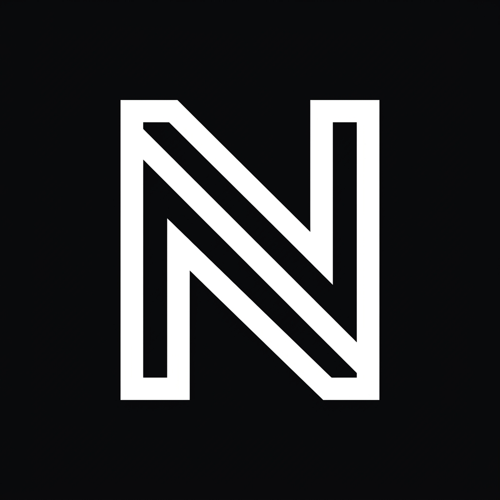

<div align="center">

<br />



<br />
<br />

# NOMOS

**Personal Financial Intelligence — Mobile First**

A mobile-first PWA for tracking personal finances with an AI-powered command center. Record transactions in natural Bahasa Indonesia, visualize cash flow, and manage your budget — all from your phone.

<br />


</div>

---

## Overview

NOMOS is a **mobile-first Progressive Web App** that serves as a personal finance command center. Instead of manually filling forms, users can type transactions in natural language ("Gaji masuk 8.5jt di BCA" or "abis beli kopi gopay 25rb") — the AI engine extracts the financial entities and presents a confirmation draft before saving.

---

## Features

### Command Center (AI Chat)
- Natural language transaction input in Bahasa Indonesia
- Fuzzy input tolerance — typos and slang are normalized automatically
- AI extracts: amount, type, account, category, description
- Confirmation draft card before any data is saved
- Real-time streaming response

### Dashboard
- **Vault Widget** — Total balance across all accounts with a 7-day sparkline
- **Budget Radar** — Per-category spending progress against budget limits
- **Cashflow Matrix** — 6-month income vs. expense bar chart

### Ledger
- Full transaction history with chronological grouping
- Tap-to-detail bottom sheet for individual transactions
- Manual "Add Transaction" form with category and account selection
- Delete individual transactions

### PWA
- Installable on Android & iOS (Add to Home Screen)
- Offline-capable shell via Service Worker
- Optimized for 430px mobile viewport

---

## Tech Stack

| Layer | Technology |
|---|---|
| Framework | Next.js 16 (App Router, Turbopack) |
| Language | TypeScript 5 |
| Styling | Tailwind CSS v4 — vanilla CSS variables, no utility bloat |
| AI Runtime | Vercel AI SDK 6 — `streamText`, `streamProtocol: 'text'` |
| LLM Provider | OrcaRouter — Qwen 3.5 35B A3B |
| State | React Context + `localStorage` (`nomos_transactions_v1`) |
| Icons | Lucide React |
| Charts | Recharts |
| Toast | Sonner |
| PWA | `@ducanh2912/next-pwa` |
| ORM | Prisma + PostgreSQL *(configured, not yet active)* |

---

## Project Structure

```
src/
├── app/
│   ├── api/chat/          # AI streaming endpoint
│   ├── dashboard/
│   ├── command-center/
│   ├── ledger/
│   └── layout.tsx         # TransactionProvider + Toaster
├── components/
│   ├── layout/            # AppShell, BottomNav
│   ├── pages/
│   │   ├── dashboard/     # VaultWidget, BudgetRadar, CashflowMatrix
│   │   ├── command-center/# ChatStream, DraftCard
│   │   └── ledger/        # LedgerPage, TransactionTable, Sheets
│   └── ui/                # BottomSheet, shared primitives
├── lib/
│   ├── transaction-store.tsx  # Global state (Context + localStorage)
│   └── utils.ts               # formatCurrency, cn, helpers
└── types/
```

---

## Getting Started

### Prerequisites

- Node.js 18+
- An [OrcaRouter](https://orcarouter.ai) account with a valid API key

### Installation

```bash
# Clone
git clone https://github.com/Nazca13/nomos.git
cd nomos

# Install dependencies
npm install
```

### Environment Variables

Create a `.env` file in the project root:

```env
ORCAROUTER_API_KEY="sk-your-key-here"
```

> Get your API key from [orcarouter.ai](https://orcarouter.ai) — Dashboard → API Keys

### Development

```bash
npm run dev
```

Open [http://localhost:3000](http://localhost:3000) on your phone or use Chrome DevTools mobile emulation (430px width recommended).

### Build

```bash
npm run build
npm start
```

---

## AI Architecture

The Command Center uses a **structured text protocol** instead of tool-calling, for maximum compatibility with OpenAI-compatible providers:

```
User: "abis bayar grab 32rb pake gopay"
         ↓
  OrcaRouter / Qwen 3.5 35B
         ↓
AI Response: "Transaksi tercatat.
              [TX:{"amount":32000,"type":"EXPENSE","account":"Gopay","category":"Transport","description":"Grab"}]"
         ↓
  Client parses [TX:...] marker
         ↓
  DraftCard rendered → User confirms → addTransaction()
```

This approach works with **any OpenAI-compatible provider** — no tool schema validation, no streaming format issues.

---

## Data Persistence

All financial data is stored in `localStorage` under the key `nomos_transactions_v1`. This means:

- Data is **local to the device and browser**
- No account or backend required to get started
- Prisma + PostgreSQL schema is included for future cloud sync

---

## Roadmap

- [ ] Export to CSV / PDF
- [ ] Search & Filter in Ledger
- [ ] Custom budget goal limits
- [ ] AI spending insights ("Analisis bulan ini")
- [ ] Recurring transaction reminders
- [ ] Cloud sync via Prisma + PostgreSQL
- [ ] PWA push notifications for budget alerts

---

## License

MIT — see [LICENSE](LICENSE) for details.

---

<div align="center">

Built with precision. Designed for clarity.

</div>
